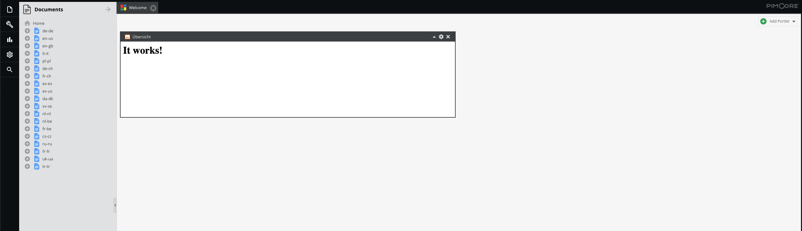
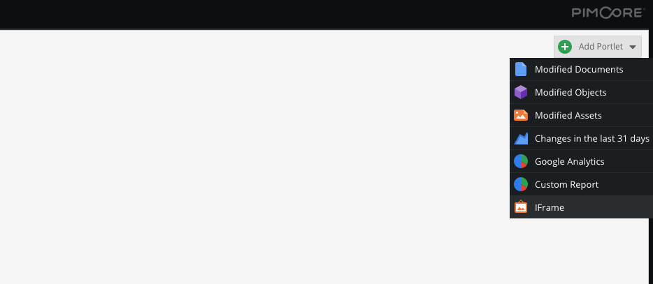
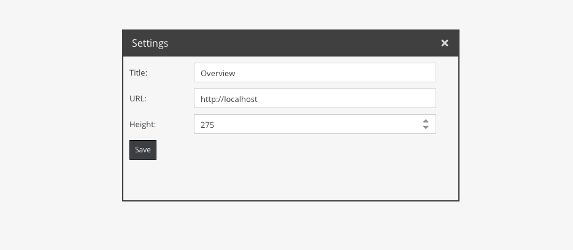

# Polargold IFrame Portlet Bundle

This [Pimcore](https://github.com/pimcore/pimcore) bundle adds a customizable IFrame portlet to the dashboard.<br />
This is a fork from [BlackbitNeueMedien/pimcore-iframe-portlet](https://github.com/BlackbitNeueMedien/pimcore-iframe-portlet), customized for our needs.

## Preview




## Requirements

This bundle was tested on Pimcore 10.x.


## Setup

To use this bundle, you need to install the composer package first.

```shell
composer require polargold/pimcore-iframe-portlet-bundle
```

Next, enable it by running:
````shell
bin/console pimcore:bundle:enable PolargoldIFramePortletBundle
````

The portlet should now be available after reloading the admin interface.


## Usage

First, add the portlet to your dashboard:



Then open the settings window:



There you can specify 3 elements:
- The title of the IFrame
- The height of the IFrame
- The URL from which the IFrame gets its content from.

If you are changing the title or height of the IFrame, you need to reload the dashboard to see your changes.<br />
URL changes will be rendered on save without reloading.
